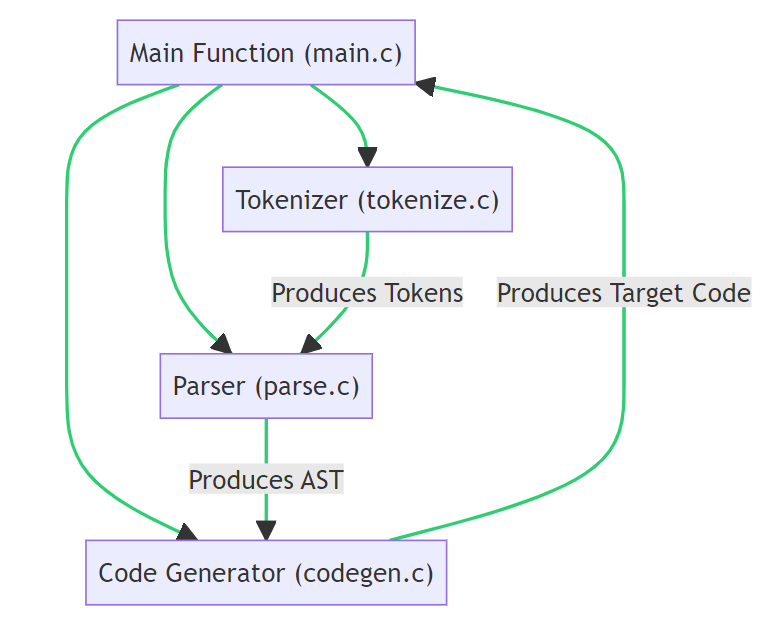

# TJ-Compiler

2023 编译原理课设 类C编译器

运行环境：Linux

完整前后端版本Github链接：https://github.com/qbdl/TJ-Compiler-Full-Version

参考开发过程与代码：[chibicc: A Small C Compiler](https://github.com/rui314/chibicc)

参考文献：[为那些想要了解低层的人编写 C 编译器简介 (sigbus.info)](https://www.sigbus.info/compilerbook)建议翻译成中文版

编译器目标代码工具（用于参考结果形式）：[Compiler Explorer](https://godbolt.org/g/c9gyca )


## 使用说明

```powershell
git clone https://github.com/qbdl/TJ-Compiler.git
cd TJ-Compiler
```

**相关命令**

```powershell
make #构建项目
make test #运行测试 
make clean #清除构建和测试过程中生成的文件
```


## 项目结构与内容

#### 分析方法：

​	自顶向下——递归下降法

#### 目标代码类型：

​	x86-64 ABI的汇编代码

#### 结构：

##### Tokenizer（词法分析器）

​	这部分的代码位于tokenize.c文件中。它的主要任务是将输入的源代码字符串分解成一个个的token。每个token都有一个类型（例如数字、标识符、关键字等）和一个值（例如token的文本内容）。

##### Parser（语法分析器）

​	这部分的代码位于parse.c文件中。它的主要任务是将token序列转换为抽象语法树（AST），并为每个AST节点添加一个类型。

​	在这个过程中，parser会检查源代码的语法，并在遇到语法错误时报错。

##### Code Generator（代码生成器）

​	这部分的代码位于codegen.c文件中。它的主要任务是将AST转换为目标代码。在这个过程中，代码生成器会遍历AST，并为每个节点生成相应的目标代码。

##### Main Function（主函数）

​	这部分的代码位于main.c文件中。它的主要任务是调用tokenizer、parser和code generator，以及处理命令行参数和文件输入/输出。



## 开发过程

  详见[开发过程.md](开发学习过程/develop_README.md)


## Makefile

```makefile
# 1、编译器和编译选项

# -g : 让编译器在生成的对象文件或可执行文件中包含调试信息
# -fno-common: 对全局变量的多重定义产生错误。-fno-common指示编译器，每一个全局变量在整个程序中都应该只有一个定义。
CC=gcc
CFLAGS=-std=c11 -g -fno-common

# 2、源文件和对象文件

#使用wildcard函数获取当前目录下所有的.c文件，并存放在SRCS变量中
#然后将SRCS中的所有.c后缀替换为.o后缀，得到对应的目标文件列表，存放在OBJS变量中
SRCS=$(wildcard *.c)
OBJS=$(SRCS:.c=.o)

# 3、目标（chibicc,test,clean)

# 3.1 chibicc目标依赖于所有的.o文件
#规则的命令部分首先使用$(CC)作为编译器
#然后是编译选项$(CFLAGS)，目标文件（-o $@），源文件（$(OBJS)）
#和链接选项$(LDFLAGS)（如果定义了的话）来生成可执行文件
chibicc: $(OBJS)
	$(CC) $(CFLAGS) -o $@ $(OBJS) $(LDFLAGS)

#所有的.o文件都依赖于chibi.h，如果chibi.h被修改，所有的.o文件都需要重新编译
$(OBJS):chibi.h

#3.2 test目标依赖于chibicc目标，如果chibicc目标不存在或者被修改，test目标需要重新生成
#首先执行chibicc，参数为tests，生成汇编代码tmp.s
#然后使用gcc编译tmp.s，生成可执行文件tmp
#最后执行tmp
test: chibicc
	./chibicc tests > tmp.s
	gcc -static -o tmp tmp.s
	./tmp

#3.3 clean目标用于清理项目，删除所有生成的文件
clean:
	rm -f chibicc *.o *~ tmp*

#3.4 声明伪目标: test和clean，避免因文件名与目标同名而导致的错误
#在Makefile中，目标通常表示一种文件，但"伪目标"并不表示实际的文件，而是用于执行一些操作，比如清理项目或运行测试。如果一个目标被声明为伪目标，那么make命令就不会去检查是否存在一个与这个目标同名的文件，而是每次都执行这个伪目标的命令。
.PHONY: test clean
```

**Makefile工作流程**：

- 当你运行make命令，它会查找Makefile文件并首先找到第一个目标（在这里是chibicc）并尝试生成它。


- chibicc目标依赖于$(OBJS)，即所有的.o文件。所以make命令就会生成每一个.o文件。


- 每个.o文件依赖于它的.c文件和chibi.h。所以对于每个.o文件，make命令就会检查对应的.c文件和chibi.h。如果任何一个文件比.o文件新，或者.o文件不存在，make命令就会运行$(CC) $(CFLAGS) -o $@ $(OBJS) $(LDFLAGS)命令重新编译生成.o文件。


- 当所有的.o文件都生成后，make命令就会运行$(CC) $(CFLAGS) -o $@ $(OBJS) $(LDFLAGS)命令链接所有的.o文件生成可执行文件chibicc。


- 当你运行make test命令，它会检查chibicc目标。如果chibicc目标不存在或者比test目标新，make命令就会重新生成chibicc目标。然后它会运行test目标的命令生成tmp可执行文件并执行它。


- 当你运行make clean命令，它会运行clean目标的命令删除所有生成的文件。[^1]

[^1]: 注意，这个Makefile假设所有的.c和.h文件都在Makefile同一目录下，且$(LDFLAGS)在环境变量或者Make命令行中定义。如果项目结构不同，可能需要修改SRCS的值以适应项目，或者在命令行中指定$(LDFLAGS)的值，例如执行时输入make LDFLAGS="-L/path/to/library -lmylib"。

