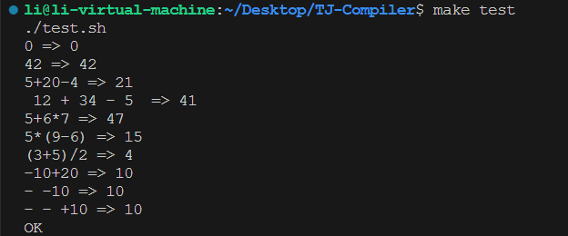
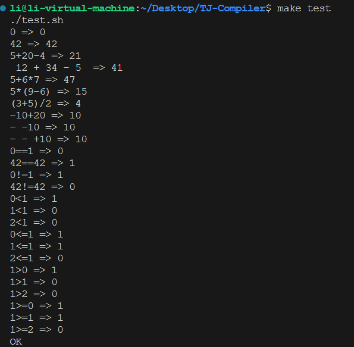
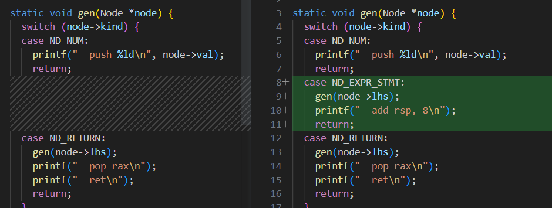

# TJ-Compiler

开发过程学习，实现与记录


### 一、1-10 commit

#### 1 :  输出数字的C->汇编

用C语言直接仿造汇编格式，用printf进行输出

```powershell
make 
ls -l test.sh
chmod +x test.sh
make test
```


#### 2 : 增加+，-符号的C->汇编

- long int strtol(const char *nptr, char **endptr, int base)——将当前指向字符转为某个基数的整数（并移动指针），直至遇到非数值/其他非法字符

  ```C++
  printf(" mov rax, %ld\n", strtol(p, &p, 10));
  ```


#### 3：可以处理空白符

**构建了词法分析器的初步体系Tokenizer**

```c++
#include<ctype.h>//用于测试和转换字符的函数
#include<stdarg.h>//处理可变数量的参数
```

[^va_start(ap, fmt)]: 这一行用于初始化va_list类型的变量ap。va_start是C语言中处理可变参数列表的宏之一。它接受两个参数：一个va_list类型的变量（在这里是ap），以及...之前的最后一个命名参数（在这里是fmt）。va_start使得**ap**可以访问error函数中传递的可变参数列表。

```C++
void error(char *fmt, ...) {
  va_list ap;//用于处理C语言可变参数列表的一种数据类型
  va_start(ap, fmt);
  vfprintf(stderr, fmt, ap);
  fprintf(stderr, "\n");
  exit(1);
}

int main() {
  int value = 42;
  error("An error occurred: value = %d", value);
  return 0;
}

fmt指向一个格式字符串（"An error occurred: value = %d"）
ap指向可变参数列表:这里是一个整数值（value）
```


#### 4：错误输出的格式精细化

引入一个全局变量char *user_input方便错误定位


#### 5： 增加了 * ， / , （）

**构建了词法分析器的初步体系Tokenizer和语法分析器的初步体系Parser,目标代码生成器CodeGen**

采用递归下降子程序，先构建出语法树，第二遍生成汇编代码（采用二叉树左右孩子的方式保存抽象语法树（AST))

[^cqo 指令]: cqo 指令（Convert Quadword to Octword）将 **rax 寄存器中的值符号扩展到 rdx:rax 双字对**中。这是为了处理可能的溢出问题。接下来，idiv rdi 指令执行有符号除法，将 rdx:rax 双字对中的值除以 rdi 寄存器中的值。商的结果存储在 rax 寄存器中，余数存储在 rdx 寄存器中。

```c++
//写法学习!!——从下往上收的过程
// expr = mul ("+" mul | "-" mul)*
static Node *expr(void)
{
  Node *node=mul();

  for(;;){
    if(consume('+'))
      node=new_binary(ND_ADD,node,mul());
    else if(consume('-'))
      node=new_binary(ND_SUB,node,mul());
    else 
      return node;
  }
}
```


#### 6： 增加了一元正号和一元减号

<center class="half">
    
    
</center>


#### 7：改进Token的struct

修改Toekn元素，加入了Token长度（原来默认为1）

```c++
int strncmp(const char* s1, const char* s2, size_t n);
//s1的前n个与s2比较
```




#### 8：增加了比较运算符

增加 **static bool startswith(char *p, char *q)** 函数来完成比较运算符的匹配





#### 9：拆分main函数得到parser,codegen,chibi.h等

更改makefile:

```makefile
CFLAGS=-std=c11 -g -static -fno-common
SRCS=$(wildcard *.c)
OBJS=$(SRCS:.c=.o)

chibicc: $(OBJS)
	$(CC) -o $@ $(OBJS) $(LDFLAGS)

$(OBJS): chibi.h

test: chibicc
	./test.sh

clean:
	rm -f chibicc *.o *~ tmp*

.PHONY: test clean

#添加了两个变量SRCS和OBJS。SRCS使用wildcard函数来自动查找当前目录下的所有.c文件，将它们放在一个列表里。OBJS则是将SRCS列表中的所有.c文件名替换成相应的.o文件名，这样就可以为每个源文件生成对应的目标文件。

#修改了chibicc的依赖。原来chibicc只依赖于main.o，现在改为依赖于所有的$(OBJS)，也就是所有的.o文件。这样，当有任何一个源文件发生变化时，chibicc都会重新编译。

#添加了$(OBJS): chibi.h这一行，表示所有的.o文件依赖于chibi.h。这样，当chibi.h发生变化时，所有的.o文件都会重新编译。
```


#### 10：支持分号，多语句

stmt = expr ";"

通过不同stmt之间的next来关联起不同句子


### 二、11-30 commit

#### 11-12：支持return + 引入ND_EXPR_STMT(expr+";")

**支持return**

is_alnum : 是否为字母，数字，下划线

```c++
// Keywords
    if (startswith(p, "return") && !is_alnum(p[6])) {
      cur = new_token(TK_RESERVED, cur, p, 6);
      p += 6;
      continue;
    }
//巧妙的判断特殊词的方法（return后面没有继续跟着词——跟着的不是alnum)
```


**引入ND_EXPR_STMT(expr+";")**

```c++
void foo() {
  int x = 1;
  int y = 2;
  int z = x + y;
}
```

```assembly
main:
  ; x = 1
  push 1

  ; y = 2
  push 2

  ; z = x + y
  ; 计算 x + y
  pop rdi  ; 将 y 的值弹出栈并放入 rdi
  pop rax  ; 将 x 的值弹出栈并放入 rax
  add rax, rdi  ; 将 rax 和 rdi 的值相加（x + y）

  ; 将计算结果（z）压入栈
  push rax
  
  ; 函数结束
  ret
```

​	在这个例子中，我们首先将x和y的值压入栈。之后，我们将它们弹出栈并计算它们的和。接着，我们将计算结果（z）压回栈中。现在，栈顶值是z的值，计算结果仍存为z值，所以暂时不需要add rsp 8。

```assembly
;但如果仅是x+y;这样的表达式，最后计算出的结果没有继续用到，就需要加入下述汇编代码(现在暂时认为被分号结束的计算结果没有被继续使用）
add rsp, 8  ; 将栈指针加8，从而将栈顶值（z的值）弹出
```

​	这就是为什么在处理ND_EXPR_STMT类型的节点时，我们需要将rsp加8来将栈顶值弹出。


​	同时原来处理是将元素pop出来，现在是直接用add rsp, 8

<center class="half">
    
    
</center>


#### 13： 支持单字符局部变量

引入TK_IDENT,   // Identifiers（标识符/变量）


##### **赋值部分的处理：**


##### 存取数据的方法：

存，取，计算变量地址


为了引入局部变量，作的修改（为变量分配空间，调整栈指针）：


[^lea指令说明]: 专门用于取有效地址而不是具体值的

```assembly
举一个例子，假设我们有以下两个汇编指令：

mov rax, [rbp-8]
lea rax, [rbp-8]
对于第一个指令mov rax, [rbp-8]，CPU会执行以下操作：
	计算内存地址：rbp - 8
	访问该地址：读取地址rbp - 8处的数据
	将数据加载到寄存器rax

对于第二个指令lea rax, [rbp-8]，CPU会执行以下操作：
	计算内存地址：rbp - 8
	将计算结果（即地址本身）加载到寄存器rax
```


##### 引入栈式空间：RSP,RBP

具体空间分布图如下：


假设有如下代码：

```c++
void f(void){
    int a;
	return;
}
void g(void){
	int x,y;
    f();
    return;//<-f的返回地址(f的下一条指令)
}
int main(){
	g();
    return 0; //<-g的返回地址（g后的下一条指令）
}
```

对应栈及变化如下：


代码修改如下：

```C++
void codegen(Node *node) {
  printf(".intel_syntax noprefix\n");
  printf(".global main\n");
  printf("main:\n");

  // Prologue(新增)这里暂时假设只有main一个函数，并且提前为它分配了26个字母的局部变量空间
  printf("  push rbp\n");
  printf("  mov rbp, rsp\n");
  printf("  sub rsp, 208\n");//208=26*8(该系统1个int占8字节，64位)

  for (Node *n = node; n; n = n->next)
    gen(n);

  // Epilogue(新增)
  printf(".L.return:\n");//L的返回地址指向位置
  printf("  mov rsp, rbp\n");
  printf("  pop rbp\n");
  printf("  ret\n");//返回调用者的返回地址,并且RSP-8，后续让调用者继续执行下一条指令
}
```


#### 14：支持多字符局部变量

真正开始管理局部变量（此时是用链表管理），并且根据变量的具体内容分配空间

​	**主体变化：**

1. tokenize=>可以分出abcd这种的词为Identifier(变量)
2. parser=>局部变量指针表，每次判断为identifier时对表进行操作
   - 单独把**变量char*name封装成Var**（增加了next指针，基于rbp的offset）
   - 把**最外层Node封装成Function **（对应每个函数里用于记录**起始Node节点(根),栈大小，局部变量列表**）
   - main里在 目标代码生成前 进行 局部变量空间 的计算
3. codegen=>需要为局部变量分配空间


[^#define _GNU_SOURCE]: #define _GNU_SOURCE是一个宏定义，用于告诉C编译器启用GNU扩展特性。这些特性包括了一些额外的函数和头文件，它们不在标准C库中。启用这些特性可以让你使用GNU libc库提供的额外功能，这些功能可能在其他实现中并不存在。在这个特定的代码中，它主要用于确保在编译时包含了GNU扩展特性。

```C++
char *strndup(const char *s, size_t n);//string n duplicate
//strndup函数返回一个指向新创建的字符串的指针，这个新字符串包含了源字符串的前n个字符（如果源字符串的长度小于n，则复制整个字符串），并会自动添加'\0'作为字符串的结尾。如果分配内存失败，函数返回NULL。
```


#### 15：支持if语句

将算符与关键字等 都归为保留字


[^学习]: 把全局的数组（但只在一个函数用到的）=>函数内部，用static使只生成一遍！！

```c++
static char *ops[] = {"==", "!=", "<=", ">="};
 for (int i = 0; i < sizeof(ops) / sizeof(*ops); i++
//sizeof(ops) / sizeof(*ops)利用指针的固定大小来巧妙计算数组个数
```


```assembly
;新的文法修改
program = stmt*
stmt    = expr ";"
        | "if" "(" expr ")" stmt ("else" stmt)?
        | "while" "(" expr ")" stmt
        | "for" "(" expr? ";" expr? ";" expr? ")" stmt
        | ...
```

主要是codegen的修改：它在这个部分利用汇编里的je，jmp等函数结合标签label直接进行跳转，就省去了原来代码里的M,N的增加与处理(得益于两遍使得提前知道了树的结构，有无else等信息)

```c++
case ND_IF: {
    int seq = labelseq++;//当前的 if-else 语句生成一个唯一的序号，以便在生成汇编代码时引用正确的标签。
    if (node->els) {
      gen(node->cond);//生成条件表达式的汇编代码
      printf("  pop rax\n");//从栈中弹出条件表达式的结果并将其存储在寄存器 rax 中
      printf("  cmp rax, 0\n");
      printf("  je  .L.else.%d\n", seq);//如果比较结果为相等（即条件表达式的结果为假），则跳转到对应的 .L.else 标签执行 else 子句。
      gen(node->then);
      printf("  jmp .L.end.%d\n", seq);//if 子句执行完成后，跳转到对应的 .L.end 标签，跳过 else 子句的执行
      printf(".L.else.%d:\n", seq);
      gen(node->els);
      printf(".L.end.%d:\n", seq);
    } else {
      gen(node->cond);//生成条件表达式的汇编代码
      printf("  pop rax\n");
      printf("  cmp rax, 0\n");
      printf("  je  .L.end.%d\n", seq);
      gen(node->then);
      printf(".L.end.%d:\n", seq);
    }
    return;
  }
```

举例说明：

```c++
if (a < b) {
  x = 1;
} else {
  x = 2;
}
```

汇编代码：

```assembly
; 计算条件表达式 a < b，并将结果压入栈
; 对应 gen(node->cond);
; ...
pop rax ; 弹出栈顶元素（即条件表达式的结果）并将其存储在 rax 中
cmp rax, 0 ; 将 rax 与 0 进行比较
je  .L.else.1 ; 如果条件表达式为假（即 a >= b），则跳转到 .L.else.1
; 生成 if 子句（then 子句）的汇编代码
; 对应 gen(node->then);
; ...
jmp .L.end.1 ; 跳转到 .L.end.1，跳过 else 子句的执行
.L.else.1:  ; 生成对应的 .L.else.1 标签
; 生成 else 子句的汇编代码
; 对应 gen(node->els);
; ...
.L.end.1:  ; 生成对应的 .L.end.1 标签
```


#### 16-17：while,for

while类似，for增加了 Node *init; Node *inc;两种节点


#### 18：实现函数块Block("{}"内可以包含多语句)

将一个Block内部的语句用Node链表连起来


#### 19：能够识别没有参数的函数调用

原有makefile部分

```makefile
#将输入的两个参数赋值给本地变量 expected 和 input。
  expected="$1"
  input="$2"
# 调用当前目录下的 chibicc 可执行文件，并将 $input 作为参数传递给它。将 chibicc 的标准输出重定向到名为 tmp.s 的文件中。如果执行出错（返回值非 0），则退出脚本。
  ./chibicc "$input" > tmp.s || exit
# 调用 gcc 编译器，将名为 tmp.s 的汇编代码文件作为输入文件，并生成名为 tmp 的静态可执行文件。
  gcc -static -o tmp tmp.s
# 运行 tmp 可执行文件，将其输出结果存储在本地变量 actual 中
  ./tmp
  actual="$?"
```

在makefile文件中增加函数调用的部分

```makefile
cat <<EOF | gcc -xc -c -o tmp2.o -
int ret3() { return 3; }
int ret5() { return 5; }
EOF

#cat <<EOF：这是一种称为“Here Document”的技巧，在这里，cat 命令会读取并输出随后的所有行，直到遇到一个“EOF”行为止。这里的 EOF 可以替换为任何其他的字符串，用作结束标记。

#gcc -xc -c -o tmp2.o -：这部分代码使用 gcc 编译器将从上面的 Here Document 中读取到的代码编译成一个目标文件（tmp2.o）。以下是各个选项的解释：
# -xc：将输入文件视为 C 语言源代码。
# -c：仅编译源代码，不链接，生成目标文件。
# -o tmp2.o：指定输出文件名为 tmp2.o。
# -：从标准输入读取源代码，而非从文件中读取。
```


函数调用：增加了call()

修改式子：用于区分函数还是变量


#### 20: 支持至多6个参数的函数调用

这里目前采用的是寄存器来传递函数的参数（而不是栈）

```c++
static char *argreg[] = {"rdi", "rsi", "rdx", "rcx", "r8", "r9"};

case ND_FUNCALL:{
      int nargs=0;
      for(Node *arg=node->args;arg;arg=arg->next){
        gen(arg);//此时是函数（）里传的参数，例如int result = add(3, 5);的3和5
        nargs++;
      }

      for(int i=nargs-1;i>=0;i--)
        printf("  pop %s\n",argreg[i]);//从栈上弹出参数并将它们放入相应的寄存器中
      
      printf("  call %s\n", node->funcname);//原有——在参数已经准备好后开始函数调用
      printf("  push rax\n");//原有——函数执行完成后，返回值将存储在寄存器 rax 中。将其压入栈中，以便在稍后的计算中使用
      return;
    }
```


#### 21：修改栈帧使其为16的倍数

[^x86-64 ABI的要求]: x86-64 函数调用的 ABI 很简单（只要您按照上述方式进行操作），但有一个警告。 RSP 必须是 16 的倍数，然后才能进行函数调用。 Ya 以 8 字节为单位更改 RSP，因此在发出指令时，RSP 不一定是 16 的倍数。 如果不遵守这个承诺，假设RSP是16的倍数的函数将受到一种神秘现象的困扰，这种现象只有一半时间下降。 尝试在调用函数之前调整 RSP，使 RSP 是 16 的倍数。

```c++
   // We need to align RSP to a 16 byte boundary before
    // calling a function because it is an ABI requirement.
    // RAX is set to 0 for variadic function.
    int seq = labelseq++;
    printf("  mov rax, rsp\n");
    printf("  and rax, 15\n");//对RAX进行按位与操作，保留其低4位。如果RSP与16字节边界对齐，结果将为0。
    printf("  jnz .L.call.%d\n", seq);//如果RAX不为0，即RSP未与16字节边界对齐，跳转到.L.call.%d标签（%d为生成的序列号）
    printf("  mov rax, 0\n");
    printf("  call %s\n", node->funcname);
    printf("  jmp .L.end.%d\n", seq);
    printf(".L.call.%d:\n", seq);
    printf("  sub rsp, 8\n");//从栈指针（RSP）中减去8，为对齐做准备(此时就已经是16的倍数了)
    printf("  mov rax, 0\n");
    printf("  call %s\n", node->funcname);
    printf("  add rsp, 8\n");//将之前减去的8加回栈指针（RSP），恢复RSP
    printf(".L.end.%d:\n", seq);
    printf("  push rax\n");
    return;
```


#### 22：支持没有变量的函数定义


将函数->函数指针

全局加入 当前调用的函数名


#### 23：支持至多6个参数的函数定义

学习函数里 参数的写法

```c++
static VarList *read_func_params(void)
{
  if(consume(")"))
    return NULL;
  
  //has params
  VarList *head=calloc(1,sizeof(VarList));
  head->var=new_lvar(expect_ident());
  VarList *cur=head;

  while(!consume(")")){
    expect(",");
    cur->next=calloc(1,sizeof(VarList));
    cur->next->var=new_lvar(expect_ident());
    cur=cur->next;
  }

  return head;
}


// function = ident "(" params? ")" "{" stmt* "}"
// params   = ident ("," ident)*
static Function *function(void) 
{
  locals = NULL;

  Function *fn=calloc(1,sizeof(Function));
  fn->name = expect_ident();
  expect("(");
  fn->params=read_func_params();
  expect("{");

  Node head = {};
  Node *cur = &head;

  while (!consume("}")) {
    cur->next = stmt();
    cur = cur->next;
  }

  fn->node = head.next;
  fn->locals = locals;
  return fn;
}
```

先有主函数，传入调用的函数的参数，然后才调用函数


#### 24：改进报错格式

增加了当前的tok用于更精准的定位


#### 25：增加 取地址&与 取内容*


```c++
int main() {
  int x = 10;
  int *p = &x;
  int  y= *p;
  return 0;
}

//当处理到节点 p = &x 时，我们需要计算变量 x 的地址。这里的 gen() 函数将识别节点类型为 ND_ADDR，并调用 gen_addr() 函数来计算 x 的地址。在 gen_addr() 函数内，由于 x 是一个变量，因此使用 ND_VAR 分支生成汇编代码，计算 x 在栈帧中的地址，并将其推入栈中。

//同理，接下来，处理节点 y = *p，我们需要解引用指针 p。gen() 函数将识别节点类型为 ND_DEREF，并调用 gen() 函数计算 p 的值。此时p也是一个变量，因此使用 ND_VAR 分支生成汇编代码，计算 p 在栈帧中的地址，并将其推入栈中。
//然后，调用 load() 函数，从栈顶弹出指针 p 的值（x 的地址），读取该地址处的值（x 的值），并将结果（x 的值）推回栈中。最后，将计算出的值赋给变量 y。
```


#### 26：引入变量类型，允许指针进行运算

修改了节点类型：

```c++
  ND_ADD,       // +
  ND_SUB,       // -
  
=>ND_ADD,       // num + num
  ND_PTR_ADD,   // ptr + num or num + ptr
  ND_SUB,       // num - num
  ND_PTR_SUB,   // ptr - num
  ND_PTR_DIFF,  // ptr - ptr
```

给Node增加了一个Type的属性（目前是int / pointer to int）

[^增加了add_type函数]: 这是一个递归函数，用于遍历抽象语法树（AST）并向下为每个节点添加类型信息。它首先递归地处理每个节点的子节点，然后根据节点的种类（kind 字段）决定如何为节点分配类型。


```c++
printf("  pop rdi\n");
printf("  pop rax\n");

switch (node->kind) {
  case ND_ADD:
    printf("  add rax, rdi\n");
    break;
  case ND_PTR_ADD:
    printf("  imul rdi, 8\n");//rdi里存储的是指针的增量，由于是在增加 p 的值以使其指向下一个 int，所以增量要乘以8（这里x86-64架构 int 通常是8字节）
    printf("  add rax, rdi\n");
    break;
  case ND_SUB:
    printf("  sub rax, rdi\n");
    break;
  case ND_PTR_SUB:
    printf("  imul rdi, 8\n");
    printf("  sub rax, rdi\n");
    break;
  case ND_PTR_DIFF:
    printf("  sub rax, rdi\n");
    printf("  cqo\n");//cqo 将 rax 中的值扩展到 rdx:rax 中
    printf("  mov rdi, 8\n");
    printf("  idiv rdi\n");
    break;
        
//使用 System V ABI，它规定函数的前两个整数参数通过寄存器 rdi 和 rsi 传递，返回值通过寄存器 rax 返回
//static char *argreg[] = {"rdi", "rsi", "rdx", "rcx", "r8", "r9"};
```


#### 27：引入变量类型(关键字)int，非常正经的代码生成了

​	之前：变量和函数的所有返回值都是隐式 int，没有使用变量的类型名称定义变量，而是假设所有新标识符都是新的变量名称

​	现在：不要再将新标识符视为变量名称——如果出现未定义的变量，请引发错误。


增加了declaration的语法，并且将读取变量参数的函数进行拆分（单参数读取)


将expect功能拆分出peek函数（Returns true if the current token matches a given string）


#### 28：支持一维数组

更新变量的类型：

```c++
struct Type {
  TypeKind kind;//类型
  int size;// sizeof() value——新增
  Type *base;//基地址
  int array_len;//新增
};
```

把类型的读取进行了修改：e.g int a[10]类型=>int [10] + a

```c++
static Type *read_type_suffix(Type *base) {
  if (!consume("["))
    return base;
  int sz = expect_number();
  expect("]");
  return array_of(base, sz);
}

static VarList *read_func_param(void) {
  Type *ty = basetype();
  char *name = expect_ident();
  ty = read_type_suffix(ty);

  VarList *vl = calloc(1, sizeof(VarList));
  vl->var = new_lvar(name, ty);
  return vl;
}

```

普通基地址->数组地址(升一层)

```c++
Type *array_of(Type *base, int len) 
{
  Type *ty = calloc(1, sizeof(Type));
  ty->kind = TY_ARRAY;
  ty->size = base->size * len;
  ty->base = base;
  ty->array_len = len;
  return ty;
}
```

目标代码生成时（赋值，变量生成，取内容），需要判断是否为数组类型


#### 29：支持多维数组

支持"[ ]"递归读取


#### 30：支持[ ]运算符 

除了定义，其他时候也能使用a[num]的取内容操作


在原来的primary的基础上允许了后缀 "[" expr  "]"


### 三、31-40 commit

#### 31：支持sizeof

sizeof也是单元运算符

```assembly
primary = "(" expr ")" | ident func-args? | num
;修改为=> 
primary = "(" expr ")" | "sizeof" unary | ident func-args? | num
```


#### 32：支持全局变量

到目前为止，高层应该只允许函数定义。改变那个语法，让它能在顶层写全局变量。

参考汇编代码生成：https://godbolt.org/g/c9gyca

​	需要解决的问题：

- 与全局函数的识别区别
- 不放在局部变量的堆栈上，放在特定的位置使得全局可以访问（放在数据段）


``` 
chibi.h里：将Function函数进一步封装成Program(增加了指向全局变量的链表指针VarList * globals)

parse.c里：program = function* 修改为 program = (global-var | function)*
			之前支持localvar(lvar),现在增加支持globalvar(gvar)
			提前判断变量与函数的区别后解析(有无"（" )
codegen.c里:
			将全局变量放在.data数据段上
				在汇编代码中，.zero是一条伪指令，用于分配并初始化一段内存。.zero后面的参数指定了要分配				的内存大小（以字节为单位），并将这些字节设置为零。
			并增加了.text段:存放代码
```


具体例子：

```c++
#include <iostream>
// 全局变量
int g_variable = 10;
void func() {
    int localVar = g_variable * 2;
    std::cout << "Local variable: " << localVar << std::endl;
}
int main() {
    func();
    return 0;
}
```

对应汇编：

```assembly
# g_variable 在数据段（.data）中分配空间并初始化
.globl g_variable
.data
g_variable:
    .long 10

# func 函数
.globl func
.type func, @function
func:
    pushq %rbp
    movq  %rsp, %rbp
    subq  $16, %rsp

    # 从全局变量 g_variable 加载值到寄存器 %eax
    movl  g_variable(%rip), %eax

    # 将 %eax 中的值乘以 2
    addl  %eax, %eax

    # 将计算结果存储到局部变量 localVar
    movl  %eax, -4(%rbp)

    # 输出局部变量
    # 省略输出部分的汇编代码，以保持简洁

    leave
    ret

# main 函数
.globl main
.type main, @function
main:
    pushq %rbp
    movq  %rsp, %rbp

    # 调用 func 函数
    call func

    # 返回值为0
    movl  $0, %eax

    leave
    ret
```

通过类似访问data区来访问全局变量（所以只需要记录它的名字即可）——真正的地址解析和链接是在汇编代码到可执行程序的阶段完成的。

[^具体解释]: 全局变量的引用和解析主要在两个阶段进行：
[^1]: 源代码到汇编代码： 在这个阶段，编译器会从源代码中识别出全局变量，并在生成的汇编代码中插入对这些全局变量的引用。例如，上面g_variable是一个全局变量，**编译器在生成的汇编代码中插入了对它的引用**。具体来说，当func()函数需要访问g_variable时，编译器生成了一条movl指令来从g_variable加载值。
[^2]: 汇编代码到可执行程序： 在这个阶段，汇编器和链接器将汇编代码转换为可执行程序。在这个过程中，**链接器会解析汇编代码中的全局变量引用，并将它们连接到正确的内存地址**。例如，在我的示例中，链接器会找到g_variable的内存地址，并将movl指令中的g_variable引用替换为这个内存地址。


#### 33：支持char类型

peek函数：匹配字符串

[^“~”]: 对某一常数转化为二进制时对各位进行取反，是一种位运算，用于作掩码

```c++
int align_to(int n, int align) {//因为出现1字节的了，不是都是原始基数的整数倍，所以需要内存对齐
  return (n + align - 1) & ~(align - 1);
}

//(n + align - 1) 这个表达式把 n 增加到比下一个 align 的倍数少1的位置。

//~(align - 1) 这个表达式创建一个位掩码，掩码中的所有位都是1，除了小于 align 的位置上的位。

//然后我们将前两个步骤的结果进行位与操作，这会将低于 align 的位清零，从而实现向上舍入到 align 的倍数。
```


[^x86-64架构特性]: 在x86-64架构中的一个特性：当我们使用 mov  向32位的寄存器别名（例如EAX）写入数据时，相应的64位寄存器（例如RAX）的高32位会被清零。但是，如果我们向8位的寄存器别名（例如AL）写入数据，那么相应的64位寄存器的高56位则保持不变。这种不一致的行为是由于x86-64指令集长期演变的结果。


所以，为了保证结果的一致性，在读取单字节值时应该使用 **movsx(move with sign-extend) 或 movzx(move with zero-extend)，而不是mov**，用于将较小的源操作数扩展到较大的目标操作数。movsx 执行带符号扩展，movzx 执行无符号扩展。

当读取单字节值并将其放入更大的寄存器时，它们能确保高位被正确地填充。movsx 会将源操作数的最高位（符号位）复制到目标的所有高位，而 movzx 则将目标的所有高位清零。这样**无论是8位的还是32位的的高位部分都会被统一处理，避免了不一致性**。


```c++
static char *argreg1[] = {"dil", "sil", "dl", "cl", "r8b", "r9b"};
static char *argreg8[] = {"rdi", "rsi", "rdx", "rcx", "r8", "r9"};

//按照 System V AMD64 ABI（应用程序二进制接口），在调用函数时，前六个整数或者指针参数会通过 rdi，rsi，rdx，rcx，r8，r9 这六个64位寄存器传递。对于 1 字节（char 类型）的参数，会使用对应的低 8 位寄存器，即 dil，sil，dl，cl，r8b，r9b。

//https://zhuanlan.zhihu.com/p/565060715————x86-64所有寄存器图
```


[^load与store的区别]: 加载和存储操作的处理方式不同

存储操作（从寄存器到内存）：这个操作相对简单直观，即直接把寄存器中的数据复制到内存中。具体复制多少位数据，取决于指定的目标数据大小，例如mov byte ptr [address], al操作只会复制 8 位，而mov dword ptr [address], eax操作会复制 32 位。

加载操作（从内存到寄存器）：这个操作略微复杂一些。当我们使用一个mov指令，如mov eax, dword ptr [address]，来加载 32 位数据到寄存器时，x86-64架构会自动将寄存器的高 32 位清零。这是由于历史上的设计决定，可以防止旧的32位程序在新的64位环境下运行时出现问题。然而，当我们只加载 8 位或 16 位数据时，高位则保留原来的值，不会自动清零。这是因为早期的 x86 程序经常会使用这种方式来在同一个寄存器中存储和处理多个独立的数据。


#### 34：支持字符串

存储在数据区里的

```c++
int sprintf(char *str, const char *format, ...);
//它将根据format字符串，将后续的参数格式化并写入str字符串
//e.g sprintf(buf, ".L.data.%d", cnt++);
```

```c++
static char *new_label(void) 
{
  static int cnt = 0;//精巧的设计！！！学习！！
  char buf[20];
  sprintf(buf, ".L.data.%d", cnt++);
  return strndup(buf, 20);
}
```


#### 35：支持 **\a, \b, \t, \n \v, \f, \r, \e and \0**

转义字符处理：‘ \ ' 在程序里表示为 ’ \ \ '(第一个表示转义，第二个表示该字符为 \ )


#### 36：支持GNU表达式，允许表达式里内嵌语句

```c++
#include <stdio.h>
int main()
{

        int sum = 0;

        sum = ({
                        int s = 0;
                        for(int i = 0; i < 10; i++)
                                s += i;
                        s;   // 语句表达式的值等于最后一个表达式的值
                        });
        printf("sum = %d\n", sum);

        return 0;
}
//表达式最外面使用()，里面使用{}括起来代码块。
```

GNU C

```c++
// stmt-expr = "(" "{" stmt stmt* "}" ")"
// Statement expression is a GNU C extension.
static Node *stmt_expr(Token *tok) {
  Node *node = new_node(ND_STMT_EXPR, tok);
  node->body = stmt();
  Node *cur = node->body;

  while (!consume("}")) {
    cur->next = stmt();
    cur = cur->next;
  }
  expect(")");

  if (cur->kind != ND_EXPR_STMT)//函数检查最后一个语句的类型。如果这个语句的类型不是 ND_EXPR_STMT，函数会抛出错误，因为 GNU C 的语句表达式的结果是由它的最后一个语句决定的，而这个语句必须是一个表达式语句，否则它就无法生成一个值。
    error_tok(cur->tok, "stmt expr returning void is not supported");
  memcpy(cur, cur->lhs, sizeof(Node));//函数通过 memcpy 函数将 cur->lhs 的内容复制到 cur 中，然后返回 node。这个操作的目的应该是将最后一个语句的信息（例如它的值）复制到 cur 中，这样语句表达式的结果就可以通过 cur 得到。
  return node;
}
```


#### 37：从文件中读取代码而不是argv[1]

```shell
  		  ./chibicc "$input" > tmp.s
=>修改为   ./chibicc <(echo "$input") > tmp.s

# ./chibicc <(echo "$input") > tmp.s 这个命令使用了进程替换 <()，在此情况下，echo "$input" 的输出会被作为 ./chibicc 的输入。在 Unix 系统中，这等同于将 $input 的内容写入到一个临时文件，然后 ./chibicc 从这个临时文件中读取输入。

# 而 ./chibicc "$input" > tmp.s 这个命令则将 $input 作为 ./chibicc 的命令行参数。在这种情况下，./chibicc 需要能够处理从命令行参数中获取输入的情况。也就是说，chibicc 程序的实现必须能够接受命令行参数作为输入。

# 这两种写法在语义上是有区别的，使用哪一种需要取决于 ./chibicc 是如何处理输入的。

# 关于为什么原来的代码与读取文件输入有关，是因为进程替换 <() 在 Unix 系统中会创建一个名为 /dev/fd/<N> 的特殊文件，这个文件会被链接到 echo "$input" 的输出。在 Unix 系统中，一切都可以被当作文件来处理，包括设备，因此 ./chibicc 可以像读取常规文件一样从 /dev/fd/<N> 中读取输入。

# 这种机制允许在不需要实际创建临时文件的情况下将一个进程的输出作为另一个进程的输入，这对于处理大量数据或者在文件系统空间有限的情况下非常有用。
```

学习读文件的较完整写法

```c++
// Returns the contents of a given file.
static char *read_file(char *path) {
  // Open and read the file.
  FILE *fp = fopen(path, "r");
  if (!fp)
    error("cannot open %s: %s", path, strerror(errno));

  int filemax = 10 * 1024 * 1024;
  char *buf = malloc(filemax);
  int size = fread(buf, 1, filemax - 2, fp);
  if (!feof(fp))
    error("%s: file too large");

  // Make sure that the string ends with "\n\0".
  if (size == 0 || buf[size - 1] != '\n')
    buf[size++] = '\n';
  buf[size] = '\0';
  return buf;
}
```

[^代码学习]: 字符串被表示为字符数组，你可以通过偏移量来访问数组中的每个元素。例如，line[0]表示第一个字符，line[1]表示第二个字符，等等。同时，你也可以使用负数偏移量来访问字符数组。line[-1]表示line前面的那个字符

错误输出方式：

```c++
//   %.*s用于控制字符串的打印长度。. 表示精度，* 表示这个精度是由参数动态指定的。对于 s 转换，精度表示要打印的最大字符数。
//e.g
char* str = "Hello, world!";
printf("%.*s\n", 5, str);// 打印出前五个，即"Hello"

//错误如何输出
fprintf(stderr, "%.*s\n", (int)(end - line), line);//从line开始打印end - line的长度

//完整代码
// Reports an error message in the following format and exit.
// foo.c:10: x = y + 1;
//               ^ <error message here>
static void verror_at(char *loc, char *fmt, va_list ap) {
  // Find a line containing `loc`.
  char *line = loc;
  while (user_input < line && line[-1] != '\n')
    line--;

  char *end = loc;
  while (*end != '\n')
    end++;

  // Get a line number.
  int line_num = 1;
  for (char *p = user_input; p < line; p++)
    if (*p == '\n')
      line_num++;

  // Print out the line.
  int indent = fprintf(stderr, "%s:%d: ", filename, line_num);
  fprintf(stderr, "%.*s\n", (int)(end - line), line);

  // Show the error message.
  int pos = loc - line + indent;
  fprintf(stderr, "%*s", pos, ""); // print pos spaces.
  fprintf(stderr, "^ ");
  vfprintf(stderr, fmt, ap);
  fprintf(stderr, "\n");
  exit(1);
}
```


#### 38：支持注释

```c++
char* strstr(const char* str1,const char* str2)
//功能：strstr（）是一个参数为两个字符指针类型，返回值是char*类型的函数，它用于找到子串（str2）在一个字符串（str1）中第一次出现的位置
```


#### 39：处理作用域问题(block scope)

维护scope（当前作用域的有效变量链表）


#### 40：修改测试代码样式


### 四、41-... commit

#### 41：增加struct结构体


## 一些补充：

```c++
// -*- c -*-

// This is a line comment.

/*
 * This is a block comment.
 */

int g1;
int g2[4];

int assert(int expected, int actual, char *code) {
  if (expected == actual) {
    printf("%s => %d\n", code, actual);
  } else {
    printf("%s => %d expected but got %d\n", code, expected, actual);
    exit(1);
  }
}

int main()
{
    int t;
    return 0;
}
```

之所以没有实现printf函数却能正确编译的原因：

```
printf函数是C标准库中的函数，它在编译阶段不需要你自己去实现。在链接阶段，链接器会将你的代码和C库进行链接，以解析库函数如printf等。所以即使你的编译器代码中没有实现printf函数，但只要正确地调用了它，并在链接阶段正确地链接了C库，你的程序就可以成功运行。

例如gcc -static -o tmp_my_test tmp_my_test.s命令就在链接阶段将你的代码和C库进行了链接。这是printf能够在你的程序中运行的原因。
```


## 完成进度：


